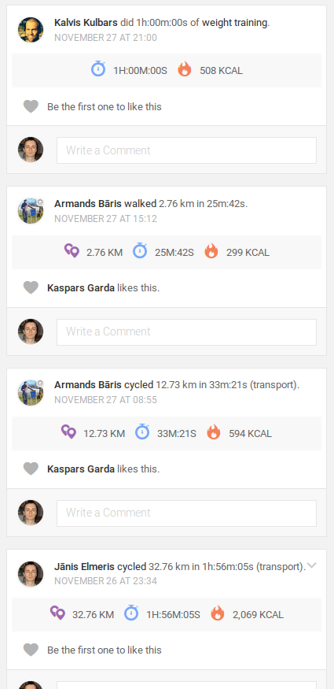
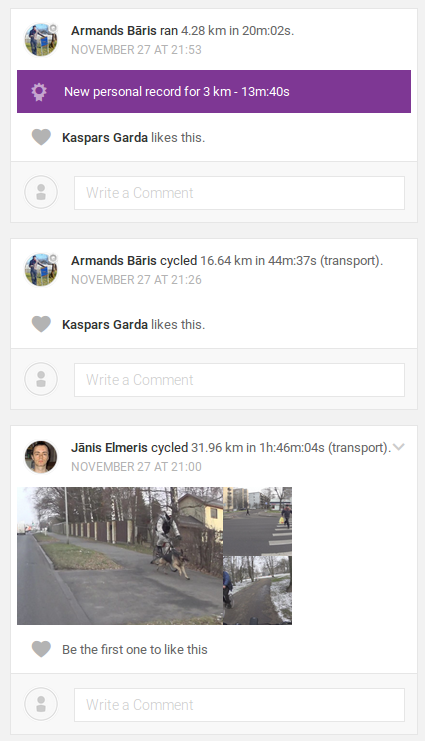

# Endomondo Design Adjustments powered by Greasemonkey

Adjustments to the new design recently introduced into the user's Endomondo home page.

In particular, I'm trying to get rid of extra clatter that visually demands my attention and makes it difficult to see what's really important.

Firstly, I remove my own avatar from all the blank comment input fields.

Secondly, I remove the workout stats along with all the colourful icons. I can already see the distance and duration in the workout title, and the calorie count is not important for me, not as important as the fire icon suggests anyway.

Design before adjustments:

Design after adjustments:

As you can see, personal records, photos and other important details are still there:

## Install

* Install "GreaseMonkey" (needs "Firefox" restart): https://addons.mozilla.org/firefox/addon/greasemonkey/
* Go to https://openuserjs.org/scripts/JanisE/Greasemonkey_EndomondoDesign and click on "Install" button and confirm.

## Customisation

This is just an example, a base for further adjustments you can do by yourself.

Go to "Tools -> Greasemonkey -> Manage User Scripts... -> Greasemonkey EndomondoDesign -> Edit this User Script" and edit the CSS adjustments as you see fit.
